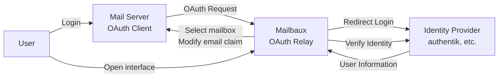

<p align="left">
    
</p>

<br/>

Mailbaux is a mailbox manager that allows users to select between multiple mailboxes and authenticate to their mail server through an existing Identity Provider (IdP).

Mailbaux acts as an OAuth2 relay between your mail server and your IdP.

Supported mail servers include solutions such as [mailcow](https://github.com/mailcow/mailcow-dockerized).

## Screenshots


## Getting Started

### Docker Compose

Get the latest version of the `docker-compose.yaml` file:

```yaml
+{{{ read "docker-compose.yaml" }}}
```

### Setup

Mailbaux requires two separate OAuth2 clients because it is involved in two different OAuth2 flows:

1. **Mail server authentication**
   - Your mail server redirects the user to Mailbaux
   - Mailbaux redirects the user to your IdP
   - The IdP authenticates the user
   - Mailbaux receives the user information
   - The user selects their mailbox.
   - Mailbaux modifies the `email` claim and completes the OAuth flow with the mail server

2. **Mailbaux interface authentication**
   - The user opens Mailbaux directly
   - Mailbaux verifies the user's identity with your IdP
   - The IdP authenticates the user
   - Mailbaux creates a session and allows the user to manage their mailboxes

The general flow:



### Configuration

Create a `.env` file in the same directory as your `docker-compose.yaml`.

Copy the example:

```dotenv
+{{{ read "examples/config.env" }}}
```

#### Defaults

```dotenv
+{{{ read "examples/defaults.env" }}}
```

#### Storage

Mailbaux requires MongoDB and Redis.

Generate secure passwords:

```bash
openssl rand -base64 32
```

Example:

```dotenv
DB_PASSWORD=SECURE_DB_PASSWORD
REDIS_PASSWORD=SECURE_REDIS_PASSWORD
```

#### Session Secret

Generate a session secret:

```bash
openssl rand -hex 32
```

Set it:

```dotenv
SESSION_SECRET=SECURE_SESSION_KEY
```

### Reverse Proxy

OAuth2 authentication should always be used over HTTPS.

An example Traefik setup:

```yaml
+{{{ read "examples/traefik.docker-compose.yaml" }}}
```

## Usage

When authenticating through Mailbaux:

1. The user starts the login process from the mail server
2. The mail server redirects the user to Mailbaux
3. Mailbaux redirects the user to the configured IdP
4. The user authenticates with the IdP
5. Mailbaux receives the user information and shows mailbox selection
6. The user selects their mailbox
7. Mailbaux modifies the `email` claim and completes the OAuth flow

The mail server now sees the selected mailbox as the authenticated identity.

## Contributing

Found a bug or have an idea for improving Mailbaux?

Feel free to open an issue or submit a pull request.

Please be respectful and patient when contributing. Mailbaux is maintained by volunteers.

## Supporting

If you find Mailbaux useful, consider giving the repository a ⭐ to help others discover it.

## License

This Project is licensed under the [MIT License](./LICENSE).
