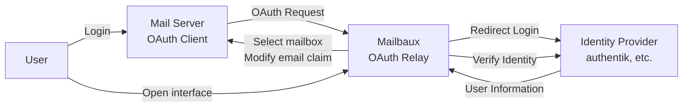

<p align="left">
    
</p>

<br/>

Mailbaux (pronounced /ˈmeɪlˌbɔːks/ like mailbawks) <br/>
is a mailbox manager that allows users to select between multiple mailboxes and authenticate to their mail server through an existing Identity Provider (IdP).

It acts as an OAuth2 relay between your mail server and your IdP.

Supported mail servers include solutions such as [mailcow](https://github.com/mailcow/mailcow-dockerized).

## Screenshots

<table>
  <tr>
    <td><strong>Home</strong></td>
    <td>
      
    </td>
  </tr>
  <tr>
    <td><strong>Select Flow</strong></td>
    <td>
      
    </td>
  </tr>
  <tr>
    <td><strong>Edit / Create / Delete</strong></td>
    <td>
      
    </td>
  </tr>
</table>

## Getting Started

### Docker Compose

Get the latest version of the `docker-compose.yaml` file:

```yaml
services:
  mailbaux:
    image: ghcr.io/codeshelldev/mailbaux:latest
    container_name: mailbaux
    ports:
      - "8070:8070"
    environment:
      DB_HOST: ${DB_HOST:-mongo:27017
      REDIS_HOST: ${REDIS_HOST:-redis:6379}
    env_file:
      - .env
    depends_on:
      - mongo
      - redis
    restart: unless-stopped
    networks:
      - mailbaux

  mongo:
    image: mongo:7
    container_name: mailbaux-db
    environment:
      MONGO_INITDB_ROOT_USERNAME: ${DB_USER:-bauxer}
      MONGO_INITDB_ROOT_PASSWORD: ${DB_PASSWORD}
      MONGO_INITDB_DATABASE: ${DB_NAME:-mailbaux}
    volumes:
      - db:/data/db
    networks:
      - mailbaux
    restart: unless-stopped

  redis:
    image: redis:7-alpine
    container_name: mailbaux-redis
    command: ["redis-server", "--requirepass", "${REDIS_PASSWORD}"]
    networks:
      - mailbaux
    restart: unless-stopped

networks:
  mailbaux:

volumes:
  db:

```

### Setup

Mailbaux requires two separate OAuth2 clients because it is involved in two different OAuth2 flows:

1. **Mail server authentication**
   - Your mail server redirects the user to Mailbaux
   - Mailbaux redirects the user to your IdP
   - The IdP authenticates the user
   - Mailbaux receives the user information
   - The user selects their mailbox.
   - Mailbaux modifies the `email` claim and completes the OAuth flow with the mail server

2. **Mailbaux interface authentication**
   - The user opens Mailbaux directly
   - Mailbaux verifies the user's identity with your IdP
   - The IdP authenticates the user
   - Mailbaux creates a session and allows the user to manage their mailboxes

The general flow:



### Configuration

Create a `.env` file in the same directory as your `docker-compose.yaml`.

Copy the example:

```dotenv
# Mail Server OAuth Client
# Created in your IdP for the mail server

MAIL_CLIENT_ID=
MAIL_CLIENT_SECRET=

MAIL_AUTHORIZATION_ENDPOINT=
MAIL_TOKEN_ENDPOINT=
MAIL_USERINFO_ENDPOINT=

MAIL_REDIRECT_URIS=https://mailbaux.domain.com/oauth/mail/callback,https://mailbaux.yourdomain.com/oauth/mail/callback
MAIL_CALLBACK_URIS=https://mail.domain.com,https://mail.yourdomain.com # This is your mailserver's oauth callback url

# Mailbaux OAuth Client
# Created in your IdP for Mailbaux

APP_CLIENT_ID= 
APP_CLIENT_SECRET=

APP_ISSUER=
APP_AUTHORIZATION_ENDPOINT=
APP_TOKEN_ENDPOINT=
APP_USERINFO_ENDPOINT=
APP_LOGOUT_ENDPOINT=

# Storage

DB_PASSWORD=SECURE_DB_PASSWORD
REDIS_PASSWORD=SECURE_REDIS_PASSWORD

# General

HOST=https://mailbaux.domain.com

SESSION_SECRET=SECURE_KEY
```

#### Defaults

These environment variables do not necessarily need to be overwritten and can be (if fine with defaults) left out.

```dotenv
# Defined in compose file
DB_USER=bauxer
DB_NAME=mailbaux

# Defined in compose file
DB_HOST=mongo:27017
REDIS_HOST=redis:6379

APP_REDIRECT_PATH=/oauth/app/callback

PREFIX=/

# Supports glob-like patterns separated by a comma.
# (See https://github.com/micromatch/micromatch#matching-features)
# Example: domain.com,example.*,*.com
ALLOWED_EMAIL_DOMAINS=*

```

#### Storage

Mailbaux requires MongoDB and Redis.

Generate secure passwords:

```bash
openssl rand -base64 32
```

Example:

```dotenv
DB_PASSWORD=SECURE_DB_PASSWORD
REDIS_PASSWORD=SECURE_REDIS_PASSWORD
```

#### Session Secret

Generate a session secret:

```bash
openssl rand -hex 32
```

Set it:

```dotenv
SESSION_SECRET=SECURE_SESSION_KEY
```

### Reverse Proxy

OAuth2 authentication should always be used over HTTPS.

An example Traefik setup:

```yaml
services:
  mailbaux:
    image: ghcr.io/codeshelldev/mailbaux:latest
    container_name: mailbaux
    labels:
      - traefik.enable=true
      - traefik.http.routers.mailbaux-secure.entrypoints=websecure
      - traefik.http.routers.mailbaux-secure.rule=Host(`mailbaux.domain.com`)
      - traefik.http.routers.mailbaux-secure.tls=true
      - traefik.http.routers.mailbaux-secure.tls.certresolver=resolver
      - traefik.http.routers.mailbaux-secure.service=mailbaux-svc
      - traefik.http.services.mailbaux-svc.loadbalancer.server.port=8070
      - traefik.docker.network=proxy
    environment:
      DB_HOST: ${DB_HOST:-mongo:27017}
      REDIS_HOST: ${REDIS_HOST:-redis:6379}
    env_file:
      - .env
    depends_on:
      - mongo
      - redis
    restart: unless-stopped
    networks:
      mailbaux:
        aliases:
          - mailbaux
      proxy:

  mongo:
    image: mongo:7
    container_name: mailbaux-db
    environment:
      MONGO_INITDB_ROOT_USERNAME: ${DB_USER:-bauxer}
      MONGO_INITDB_ROOT_PASSWORD: ${DB_PASSWORD}
      MONGO_INITDB_DATABASE: ${DB_NAME:-mailbaux}
    volumes:
      - db:/data/db
    networks:
      - mailbaux
    restart: unless-stopped

  redis:
    image: redis:7-alpine
    container_name: mailbaux-redis
    command: ["redis-server", "--requirepass", "${REDIS_PASSWORD}"]
    networks:
      - mailbaux
    restart: unless-stopped

networks:
  mailbaux:
  proxy:
    external: true

volumes:
  db:

```

## Usage

When authenticating through Mailbaux:

1. The user starts the login process from the mail server
2. The mail server redirects the user to Mailbaux
3. Mailbaux redirects the user to the configured IdP
4. The user authenticates with the IdP
5. Mailbaux receives the user information and shows mailbox selection
6. The user selects their mailbox
7. Mailbaux modifies the `email` claim and completes the OAuth flow

The mail server now sees the selected mailbox as the authenticated identity.

## Contributing

Found a bug or have an idea for improving Mailbaux?

Feel free to open an issue or submit a pull request.

Please be respectful and patient when contributing.

## Supporting

Found this project helpful? Consider leaving a ⭐️!

:)

## Help

Do you have a question or need help setting up Mailbaux?
Join our [Matrix Server](https://matrix.to/#/#codeshelldev.sso.mailbaux:matrix.org)!

## License

This Project is licensed under the [MIT License](./LICENSE).

## Legal

Logo designed by @CodeShellDev, All Rights Reserved.

This project is not affiliated with mailcow nor authentik.
