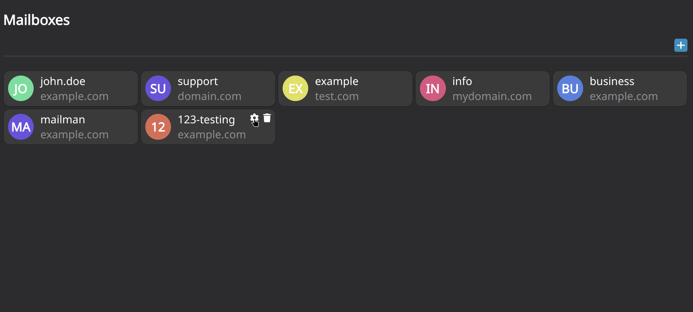
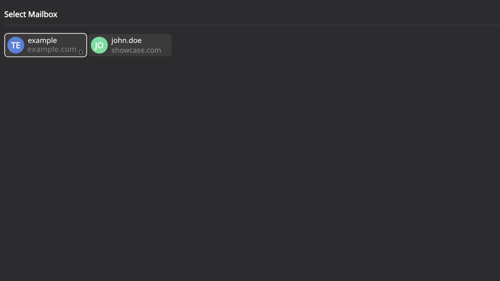

# Mailbaux

Mailbaux is a mailbox manager that allows users to select between multiple mailboxes and authenticate with their mail server (such as [mailcow](https://github.com/mailcow/mailcow-dockerized)) through an OAuth2-compatible identity provider.

## Screenshots

**Home**


**Select flow**


## Getting Started

### Docker Compose

Download the latest version of the `docker-compose.yaml` file:

```yaml
services:
  mailbaux:
    image: ghcr.io/codeshelldev/mailbaux:latest
    container_name: mailbaux
    ports:
      - "8070:8070"
    environment:
      DB_HOST: ${DB_HOST:-mongo:27017}
      DB_USER: ${DB_USER:-admin}
      DB_NAME: ${DB_NAME:-mailbaux}
      REDIS_HOST: ${REDIS_HOST:-redis:6379}
    env_file:
      - .env
    depends_on:
      - mongo
      - redis
    restart: unless-stopped
    networks:
      - mailbaux

  mongo:
    image: mongo:7
    container_name: mailbaux-db
    environment:
      MONGO_INITDB_ROOT_USERNAME: ${DB_USER:-admin}
      MONGO_INITDB_ROOT_PASSWORD: ${DB_PASSWORD}
      MONGO_INITDB_DATABASE: ${DB_NAME:-mailbaux}
    volumes:
      - db:/data/db
    networks:
      - mailbaux
    restart: unless-stopped

  redis:
    image: redis:7-alpine
    container_name: mailbaux-redis
    command: ["redis-server", "--requirepass", "${REDIS_PASSWORD}"]
    networks:
      - mailbaux
    restart: unless-stopped

networks:
  mailbaux:

volumes:
  db:
```

### Configuration

Mailbaux currently works by modifying the `email` claim during OAuth2 **Token Exchange** and **UserInfo** requests.

Because of this, Mailbaux requires an external Identity Provider (IdP), such as [authentik](https://goauthentik.io).

Create a `.env` file in the same directory as your `docker-compose.yaml` and copy the configuration template:

```dotenv
# Mail

# Get from your IdP (for your mailserver)
MAIL_CLIENT_ID=
MAIL_CLIENT_SECRET=

MAIL_AUTHORIZATION_ENDPOINT=
MAIL_TOKEN_ENDPOINT=
MAIL_USERINFO_ENDPOINT=

MAIL_REDIRECT_URIS=https://mailbaux.domain.com/oauth/mail/callback,https://mailbaux.yourdomain.com/oauth/mail/callback
MAIL_CALLBACK_URIS=https://mail.domain.com,https://mail.yourdomain.com # This is your mailserver's oauth callback url

# App

# Get this from your IdP (for mailbaux)
APP_CLIENT_ID=
APP_CLIENT_SECRET=

APP_ISSUER=
APP_AUTHORIZATION_ENDPOINT=
APP_TOKEN_ENDPOINT=
APP_USERINFO_ENDPOINT=
APP_LOGOUT_ENDPOINT=

# Storage

DB_PASSWORD=SECURE_ROOT_PW
REDIS_PASSWORD=SECURE_REDIS_PW

# General

SESSION_SECRET=SECURE_KEY # Generate with openssl

HOST=https://mailbaux.domain.com
```

#### Defaults

```dotenv
DB_USER=admin
DB_NAME=mailbaux

DB_HOST=mongo:27017
REDIS_HOST=redis:6379

APP_REDIRECT_PATH=/oauth/app/callback

PREFIX=/
```

### OAuth Setup

Configure an OAuth authentication method in your mail server.

Instead of using your IdP's OAuth endpoints, use the Mailbaux endpoints:

| Endpoint       | URL                     |
| -------------- | ----------------------- |
| Authorization  | `/oauth/mail/authorize` |
| Token Exchange | `/oauth/mail/token`     |
| User Info      | `/oauth/mail/userinfo`  |

Set the redirect URI to the value configured in your `.env` file.

## Reverse Proxy

OAuth2 authentication should always be used over a secure connection.

The following example shows a reverse proxy setup using Traefik:

```yaml
---
services:
  mailbaux:
    image: ghcr.io/codeshelldev/mailbaux:latest
    container_name: mailbaux
    labels:
      - traefik.enable=true
      - traefik.http.routers.mailbaux-secure.entrypoints=websecure
      - traefik.http.routers.mailbaux-secure.rule=Host(`mailbaux.domain.com`)
      - traefik.http.routers.mailbaux-secure.tls=true
      - traefik.http.routers.mailbaux-secure.tls.certresolver=resolver
      - traefik.http.routers.mailbaux-secure.service=mailbaux-svc
      - traefik.http.services.mailbaux-svc.loadbalancer.server.port=8070
      - traefik.docker.network=proxy
    environment:
      DB_HOST: ${DB_HOST:-mongo:27017}
      DB_USER: ${DB_USER:-admin}
      DB_NAME: ${DB_NAME:-mailbaux}
      REDIS_HOST: ${REDIS_HOST:-redis:6379}
    env_file:
      - .env
    depends_on:
      - mongo
      - redis
    restart: unless-stopped
    networks:
      mailbaux:
        aliases:
          - mailbaux
      proxy:

  mongo:
    image: mongo:7
    container_name: mailbaux-db
    environment:
      MONGO_INITDB_ROOT_USERNAME: ${DB_USER:-admin}
      MONGO_INITDB_ROOT_PASSWORD: ${DB_PASSWORD}
      MONGO_INITDB_DATABASE: ${DB_NAME:-mailbaux}
    volumes:
      - db:/data/db
    networks:
      - mailbaux
    restart: unless-stopped

  redis:
    image: redis:7-alpine
    container_name: mailbaux-redis
    command: ["redis-server", "--requirepass", "${REDIS_PASSWORD}"]
    networks:
      - mailbaux
    restart: unless-stopped

networks:
  mailbaux:
  proxy:
    external: true

volumes:
  db:
```

## Usage

When authenticating through Mailbaux:

1. You are redirected to your configured IdP.
2. After successful authentication, Mailbaux redirects you to the mailbox selection page.
3. You select the mailbox you want to authenticate with.
4. Mailbaux updates the `email` claim and completes the OAuth2 flow.

You are now authenticated with the selected mailbox.

## Contributing

Found a bug or have an idea for improving Mailbaux?

Feel free to open an issue or submit a pull request.

Please be respectful and patient when contributing. Mailbaux is maintained by volunteers.

## Supporting

If you find Mailbaux useful, consider giving the repository a ⭐ to help others discover it.

## License

This Project is licensed under the [MIT License](./LICENSE).
